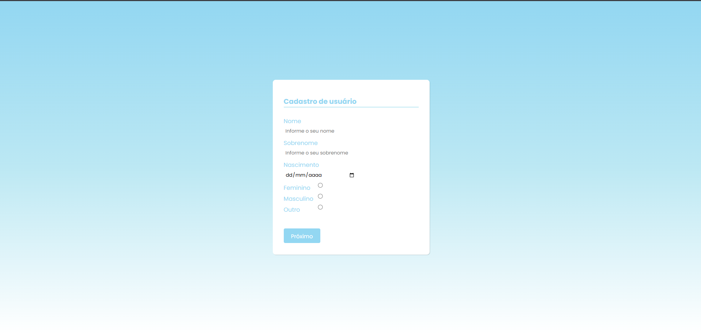

🧾 Cadastro de Usuário Multi-Step

Um formulário de cadastro dividido em etapas (multi-step), com validação de campos e navegação dinâmica utilizando JavaScript puro.

---

🚀 Demonstração

🔗 Em breve (adicione aqui o link do GitHub Pages)

---

📸 Preview

---
---

🛠️ Tecnologias utilizadas

- HTML5
- CSS3
- JavaScript (Vanilla JS)

---

✨ Funcionalidades

- 📄 Formulário dividido em etapas
- ➡️ Navegação entre etapas (Próximo / Voltar)
- ✅ Validação de campos obrigatórios
- 🔒 Campos de senha e confirmação
- 📱 Layout responsivo básico
- 🎨 Interface limpa e moderna

---

📂 Estrutura do projeto

📁 projeto/
 ├── index.html
 ├── style.css
 ├── script.js
 └── preview.png

---

📚 Aprendizados

Neste projeto, pratiquei:

- Manipulação do DOM com JavaScript
- Controle de estado (etapas do formulário)
- Validação de formulários
- Estruturação de layout com Flexbox
- Boas práticas de HTML semântico

---

🔮 Melhorias futuras

- 🔗 Integração com backend (Node.js)
- 💾 Armazenamento de dados
- 🎨 Animações entre etapas
- ⚠️ Validação mais avançada (email, senha forte)
- 🌐 Deploy online

---

👩‍💻 Autora

Desenvolvido por Izadora Vitória Silva Mariano 💙

---

